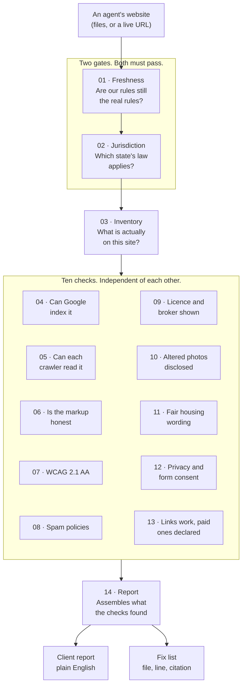

# How the auditor works

One picture of the whole run. You give it a website, it gives you two reports.

The diagram below is Mermaid, so it renders in VS Code's preview, on GitHub, and in Notion.
If you need a flat image instead, `how-it-works.png` beside this file is the same picture.

## The pipeline

## What the picture is saying

**The gates run first, and they can stop the whole thing.** Stage 01 checks that every standard
we vendored is still the live version. Stage 02 asks which state the agent works in and loads
that state's pack. An auditor that confidently enforces a dead rule is worse than no auditor.

**The ten checks do not talk to each other.** Each one owns exactly one standard and can only
issue its own kind of verdict. That is why a bad result in one place cannot quietly bend the
result somewhere else.

**Three of the checks read the state pack, not a fixed law.** Stages 09, 10 and 12 enforce
whatever stage 02 loaded. Load California and they enforce California. Load another state and
California is never mentioned.

**Stage 11 issues no verdict at all.** Fair housing wording gets surfaced and quoted, never
graded.
